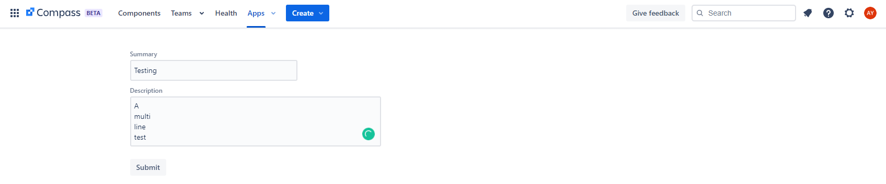
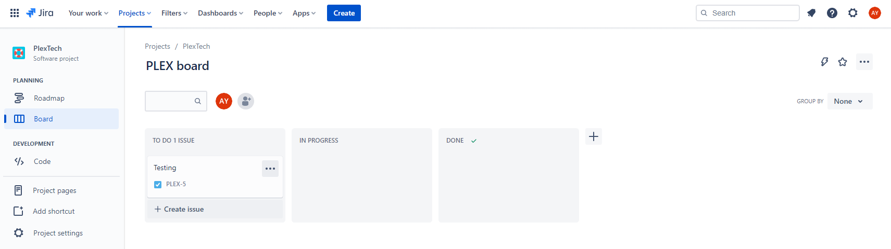

# Atlassian Forge Onboarding Project

NOTE: Do not clone this repository. You will build your app from the ground-up using Forge's command line interface, and this repository is not meant to be a template for your application.

For PlexTech's Fall 2022 project with Atlassian, we will be making use of their Platform as a Service (PaaS) application development platform: Forge. The final deliverable will be a Compass feedback app that a team administrator can install onto their Atlassian and Jira sites. On the Compass end, team members will have access to a feedback form, and feedback will be submitted as issues to a Jira board set by the team administrator. 

Compass is a new Atlassian service that simplifies DevOps organization. Individuals are grouped into teams and each team is responsible for some number of components. Components are either the team's services, libraries, or applications. Metrics and scorecards can be set for a component to track system health and measures can be set in place to promote scale engineering best practices and tame software sprawl. You are encouraged to read more about Compass [here](https://www.atlassian.com/software/compass).

Forge is Atlassian's platform for developing applications that run within Atlassian sites. Forge apps are fully hosted by Atlassian, making it easy to integrate UI components, Atlassian REST API calls, and OAuth 2. Forge also has the capability to manage multiple deployment environments, allowing for easy continuous integration and deployment. Think of Forge development as creating a single-page React application, but a lot easier. Aspects of API calls such as authentication and authorization are fully abstracted by Forge's developer libraries.

If you'd like to learn more about Forge, I highly encourage you to visit the platform's website [here](https://developer.atlassian.com/platform/forge/).

## Technical Prerequisites

Forge apps are typically written in JavaScript and follow a React-like function-component-based format. This project will be written in JavaScript, so knowledge of the language will be essential for completing this onboarding project. Note that, unlike Python, JavaScript natively supports features like promises, async/await, let/const, etc. You can learn the basics of JavaScript [here](https://www.youtube.com/watch?v=W6NZfCO5SIk). It is also recommended that you familiarize yourself with promises and async/await [here](https://www.youtube.com/watch?v=PoRJizFvM7s), as those are important aspects of sending and receiving API requests. For promises, please try to use async/await when possible and not callback functions. Please avoid the use of top-level awaits, as that's a surefire way to shoot yourself in the foot.

In addition, some React familiarity (particularly function-based components) would be valuable. For a React.js crash-course, look [here](https://www.youtube.com/watch?v=w7ejDZ8SWv8&t=2805s). However, a full understanding of React is not needed for this project. A rough idea of how components and event hook (e.g., `useState`) should be sufficient.

## Project Description

In this project, you will create an initial implementation of the Compass feedback form. Unlike the final deliverable, today you will hard-code the Jira board that the feedback will be sent to.

Your feedback form will look like this:


And any feedback sent to this form will appear as a Jira issue:


## Setup: Atlassian Account

To create a Forge app, you will first need to set up an Atlassian account. Go to [the Atlassian website](https://www.atlassian.com/) and click "My account"->"Log in". Continue with your Google account. Once you reach the Atlassian homepage, you are good to go!

## Setup: Forge

To setup Forge, we will mostly be following the instructions [here](https://developer.atlassian.com/platform/forge/getting-started/), but following this README guide should be sufficient to get you up and running.

### Installing Forge

Before you begin, first ensure that Node.js is installed. If Node.js is not installed, please visit [here](https://nodejs.org/en/download/).

You will also need to install the Forge command-line interface (CLI). Install the Forge CLI globally by running:
```
npm install -g @forge/cli
```

To verify that the CLI is installed, run
```
forge --version
```

You should see a version number appear.

### Connecting Forge to Your Atlassian Account

After logging into your Atlassian account, visit [this link](https://id.atlassian.com/manage/api-tokens) to retrieve your Atlassian API token. Click "Create API token" and give it any label you like. Make a temporary note of your token's value.

Coming back to the command line, run `forge login` to log in to the Forge CLI. Enter the email address associated with your Atlassian account and your Atlassian API token. You should see a message confirming that you have logged in:
```
√ Logged in as Adam Yang.
```

### Set up an Atlassian cloud developer site

Creating an Atlassian cloud developer site allows you to install and test your app with Jira and Compass. You can install your app to multiple Atlassian sites however, app data won't be shared between separate Atlassian sites, products, or Forge environments.

1. Go to http://go.atlassian.com/cloud-dev and create a site using the email address associated with your Atlassian account. Call your site `plextech-onboarding-{your first name}.atlassian.net`
2. Once your site is ready, log in and complete the setup wizard.
   - For "What does your team do?", select "Software Development"
   - For "What's your role?", select "Software Engineer"
   - For "Name your first space", enter `plextech-onboarding-{your first name}`
   - Skip "Invite your teammates"

Now you'll have to separately create a Compass site. Go to https://www.atlassian.com/software/compass and click "Get it free" next to the Compass banner.
Make sure your site name is still `plextech-onboarding-{your first name}.atlassian.net` and click "Agree and start now". Follow the prompts to spin up your Compass site. This may take a few minutes, so it's the perfect time for a stretch break! Follow the prompts until you reach the Compass home page.

## Your Forge App

### Creating Your Forge App

Now head back to the command line and navigate to a directory where you'll place your Forge app. At that directory, run `forge create`.
- For your app name, enter `plextech-onboarding-{your first name}`
- For the category, select "UI kit"
- For the template, select "compass-global-page"

Once your app is ready, navigate into the root directory of your project (i.e., run `cd plextech-onboarding-{your first name}`).

Your project should have the following directory structure:

```
.
+-- node_modules
+-- src
|   +-- global-page.js
+-- .gitignore
+-- manifest.yml
+-- package-lock.json
+-- package.json
+-- README.md
```

- `manifest.yml`: This is a file generated by Forge that describes your app. It contains the name and ID of the app, your app permissions, and the modules the app uses. It further defines your app's page's handler that initializes your application.
- `global-page.js`: This is where you define the behavior of your application.
- `package.json`: Common to all Node projects, this is where Node stores its metadata. See the [Node documentation](https://docs.npmjs.com/files/package.json) for more information.
- `package-lock.json`: Common to all Node projects, records the version of your app's dependencies.

Earlier, when you were creating your Forge application, I asked you to select "compass-global-page" for your template. But what exactly is that? A Compass global page is one of five Compass modules that you can define within your project's manifest. This module adds a page to Compass that is accessible by clicking on the `Apps` dropdown. Content is then rendered on a new Compass page that is accessible to all Compass users, which you'll see in a moment. It is this module where we will place our feedback form. If you'd like to read more about the `compass:globalPage`, please refer to this [documentation](https://developer.atlassian.com/platform/forge/manifest-reference/modules/compass-global-page/).

To ensure that your application has the necessary Node.js modules installed, run `npm install` at your project root.

### Deploying and Installing Your Forge App

Now that your Forge app is created, we now need to deploy it to Atlassian's servers. Run `forge deploy` at your project root. This will build, compile, and deploy your code to a development environment. This may take half a minute or so, so feel free to take another stretch break!

Now you have to install your Forge app to your Atlassian Compass site. To do so, run `forge install`.
- For your product, select "Compass"
- For your site URL, enter "plextech-onboarding-{your first name}.atlassian.net"

Congratulations! Your app is now installed on Compass. To see your app in action, go to `https://plextech-onboarding-{your first name}.atlassian.net/compass`. At the top navigation bar, you should see now that there is a little arrow to the right of the "Apps" button. Click that button and select your new application.

You will be redirected to your application's page. This is the Compass global page that we mentioned earlier! For now, there's now much, just a hello world, but we'll soon be extending your app's functionality.

### A Word About Developing Using the Forge CLI

One nice thing about developing on Forge is that your installed apps automatically pick up new deployments. For example, try going to `src/global-page.js` and replacing "Hello world!" with "Cheese is delicious". After saving this change, run `forge deploy` again and refresh your application. You should now see that the text has been updated!

The only time when you'll need to re-install your application is when you update your app's permission. Luckily, the Forge CLI makes re-installing apps very intuitive.

In terms of debugging, Forge does a few things differently. Unlike typical React applications, `console.log` in a Forge app will not output to your browser's developer console. Instead, to see the results of calls to `console.log`, you'll have to run `forge logs` on your command line. To learn more about debugging with Forge, visit [here](https://developer.atlassian.com/platform/forge/debugging/).

### Creating Your Compass Form

We will now create a form on your app's global page. This is where I won't be holding your hand as much, so you'll have to dive into the documentation yourself!

For this section of the project, I'd like you to create a form that looks like this on your app's global page:


It should have a "Summary" field, which should be of type `TextField`, and a "Description" field, which should be of type `TextArea`. Upon hitting "Submit", your form should log the input using `console.log`. You can examine the results of `console.log` by going to your command line and running `forge logs`. Remember to re-deploy your code each time you make a new change.

You can read more about UI forms at the Forge documentation [here](https://developer.atlassian.com/platform/forge/ui-kit-components/form/). This should be enough to get you started.

## Connecting Your Form to Jira

Now that you have a form up and running, let's start sending your form's information to Jira. In order to do so, you will have to send API requests to Jira from your Forge app.

### Jira: Setup

First, we need to create a project for your application to send data to. Return to `https://plextech-onboarding-{your first name}.atlassian.net/compass/`. In the upper-left-hand corner, there is a grid of 9 squares. Click on that and switch to Jira Software. Create a Kanban board and click "Select a team-managed project". Name your project "plextech-onboarding-{your first name}" and give it a private access level.

In order for your application to communicate with Jira, you must first give it the necessary permissions and install your application onto Jira. At the bottom of your `manifest.yml` file, paste the following information:
```
permissions:
  scopes:
    - write:jira-work
```

What does this do? API requests from Forge are automatically authenticated using OAuth 2.0. By adding permission scopes to your `manifest.yml` file, you are asking the user for permission to read and write to Jira. The user grants these permissions when they install your application to Compass and Jira.

After modifying your manifest file, run `forge deploy` again. You will now see a new message in the terminal:
```
We've detected new scopes or egress URLs in your app.
Run forge install --upgrade and restart your tunnel to put them into effect.
```

Since you've changed your app's permissions, you will have to reinstall your application to Compass. To do so, run `forge install --upgrade` and select your development site. Go back to your application's global page on Compass and allow your application access to Atlassian.

To make API calls to Jira, you will also have to install your application onto Jira. To do so, run `forge install` and this time select `Jira` as your product. As before, you will have to provide your site's domain.

### Jira: Constructing the REST API Call

To send information from your Compass form to Jira, we will be making use of Jira's REST API. In order to access the API from Forge, you will have to install a new Node package into your environment. At the root directory of your project, run `npm install @forge/api`.

One thing that's nice about creating Atlassian requests using the `@forge/api` library is that boring stuff like authentication happen automatically. For this section, you should reference Jira's REST API documentation, which you can find [here](https://developer.atlassian.com/cloud/jira/platform/rest/v3/intro/).

A typical request to Jira from Forge looks like the following:

```javascript
import api, { route } from "@forge/api";

const response = await api.[asApp() | asUser()].requestJira(route`/rest/api/3/issue` /* REST API route here */, {
    method: "POST", // Method type here
    headers: {
        'Accept': 'application/json',
        'Content-Type': 'application/json'
    }, // Additional headers here
    body: bodyData // Request body here
});
```

Note that the `route` object makes it so that our application works with any site. As a little quirk of Atlassian's API, if you want to access your data at your site, you'd have to prepend the API route with your site's domain (i.e., you've have to provide `https://your-domain.atlassian.net/rest/api/3/events` as your URL). The `route` object dynamically changes the domain based on which site it is running on.

Also note that you can make a request either using `asApp` or `asUser`. If you make a request using `asApp`, your request will be made with the same permissions provided to it in the `manifest.yml` file. If you make a request using `asUser` on the other hand, your request will be made with the same permissions that the user has. For this tutorial, please use `asApp`.

Now, take a look at Jira's documentation for creating a new issue with the REST API: https://developer.atlassian.com/cloud/jira/platform/rest/v3/api-group-issues/#api-rest-api-3-issue-post

Read through the "Create issue" section carefully. If you take a look at the example with Forge, you'll notice that the request payload in `bodyData` is quite large. For the purpose of this onboarding project, you will not have to provide that much data, but you will have to provide the parameter , `bodyData["fields"]["project"]` so Jira knows which project to send the issue to, as well as the parameters `bodyData["fields"]["issuetype"]`, `bodyData["fields"]["summary"]`, and `bodyData["fields"]["description"]` to actually construct the issue. For this project, please make the issue that you send to Jira is of type "Task".

Once you are done writing your code, run `forge deploy` to deploy your changes. If everything works properly, after submitting your form, you should see a new issue appear in Jira.

To test your app, try giving your form a variety of inputs, including inputs with multiple lines for your "Description" field.

#### Hint 1: What is an `issuetype`?

If you navigate to your Jira project and click "Project settings"->"Issue types", you will see that there are three default issue types: "Epic", "Task", and "Subtask". Click on "Task". If you take a look at your URL, you will see that it has a number at the end (in this case 10001). This is the ID for the "Task" issue type.

#### Hint 2: What should I put for `project`?

If you take a look at the example request [here](https://developer.atlassian.com/cloud/jira/platform/rest/v3/api-group-issues/#api-rest-api-3-issue-post), you will see that the body's fields->projects parameter takes in a dictionary with key "id":

```javascript
"project": {
    "id": "10000"
}
```

You can also identify your project using its unique key. If you go to `https://plextech-onboarding-{your first name}.atlassian.net/jira/projects`, you will see that each project has a unique key. If you supply this key in your request, Jira will know to send the issue you are constructing to that project:

```javascript
"project": {
    "key": "POA"
}
```

#### Hint 3: My request fails with "There was an error parsing JSON" when given multi-line inputs.

If your app fails when given a multiple-line input, that means that you are not escaping newline characters properly. Shockingly, there doesn't seem to be a built-in JavaScript method that will do this for you. As a solution, try looking into Javascript's `.replace` function [here](https://developer.mozilla.org/en-US/docs/Web/JavaScript/Reference/Global_Objects/String/replace) for escaping newline characters. This [Stack Overflow post](https://stackoverflow.com/questions/4253367/how-to-escape-a-json-string-containing-newline-characters-using-javascript) is also a good lead.
